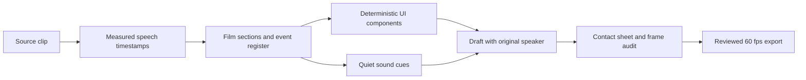

# Artifact Studio: reusable TikTok architecture

The current film is the first candidate of this direction. Its style is still awaiting user approval. The reusable pipeline is ready independently of that creative approval.

## Separation of responsibilities

| File | Responsibility |
| --- | --- |
| `index.html` | Render entry point; local fonts and project scripts |
| `overlays/developer-artifacts.js` | Film identity, theme, spring settings, speaker/deck geometry, sections and absolute event timestamps |
| `overlays/developer-aligned.js` | Measured speech anchors and corrected translated captions |
| `lib/artifact-studio.js` | Pure canvas UI painters: editor, terminal, browser frame, cursor, marker, focus reticle; scene assembly |
| `assets/demos/native-css.html` | Real HTML/CSS component used to generate verified browser states |
| `scripts/prepare-native-demos.mjs` | Capture and validate actual :has(), container-query and subgrid states |
| `lib/export-artifact-film.mjs` | Alpha rendering, speaker crops/punches, sound synthesis, mixing, encode and review artifacts |
| `lib/artifact-review.mjs` | Hash inputs so a stale contact-sheet review cannot authorize a changed film |
| `scripts/artifact-qa.mjs` | Entire timeline evidence audit, deterministic seeks, alpha checks, word anchors, decoded video and audio alignment |
| `cues.json` / `beats.json` | Generated from the same event register that drives UI actions; no separate guessed sound timeline |

The UI frames and terminal output are authored explanatory mockups, not recordings of an installation or of VS Code. The native CSS preview states are real browser-rendered components. Code excerpts are illustrative, not complete applications or measured build results. The MDN card is a labeled paraphrase, not an invented quotation.

## Production loop

1. Put source media in `clips/`. Preserve the original.
2. Derive speech timestamps from the actual audio. Check recognition mistakes against supplied text; never assume an SRT matches the clip. Do not fabricate music BPM for dialogue.
3. Edit film sections and events. Keep theme and camera settings in the film data. Reuse the exported `window.ArtifactStudio` painters, or register a new artifact scene with `register(name, draw)`. The current scene assemblies are developer-specific; new topics need new evidence and scene assemblies.
4. Build any real demo assets: `npm run video:assets`.
5. Run `npm run video:draft`. This creates the muxed draft plus `out/contact.png`, phone strips, and before/after speech-trigger frames.
6. Run `npm run video:check`. Every visible deck frame must contain an artifact. Review the generated images at phone size and inspect motion and sound in the draft. Fix weak scenes and repeat. An evidence counter is a structural check, not an aesthetic judgment.
7. Record a current-source review in `out/artifact-review.json`, including `sourceHash` from `out/artifact-audit.json` and `approvedForRender: true`, only after the contact-sheet review. This is the production review gate, not a request for user approval. The exporter refuses stale hashes.
8. Run `npm run video:final`, then `npm run video:check -- --export-only` to validate the production export. Deliver `out/final.mp4` and the named project MP4/SRT files.

For another film, create a separate timeline/caption file and small HTML/project entry, pass its data to the export harness, and register its scene assemblies. The current entry intentionally targets this developer film; it is not a general GUI or automatic transcript-to-video generator.

## Creative rules

- Top deck is evidence: code, CLI, functional component previews, or sourced documentation. No caption-sized slogan cards.
- Keep syntax readable. Use a contextual inspection zoom when a split comparison becomes too small.
- One event register drives each marker, click, tab selection and its sound. Spoken tool names use measured onsets.
- All layout shifts use closed-form springs with k=240, d=20. Full-screen rhetorical beats hide the entire deck and grid.
- Keep the speaker visible, captions at chest height, and essential UI above platform occlusion zones. Avoid decorative clutter.
- Change the artifact's state every 2–4 seconds rather than adding unrelated ornaments. Intro and outro can sustain full-screen speech while captions change.
- Quiet clicks and marker ticks; voice at original timing and gain. No music or heavy hits for this brief.

## Verified setup and limits

This machine has Node 24.13.0, Python 3.13.14, working Playwright Chromium, local Inter fonts, and bundled FFmpeg with libx264, qtrle, tmix and overlay support. No reinstall or migration to Remotion is required. The older sample film is retained in `index-standalone.html`, with its sound cues in `cues-standalone.json`.

Windows Application Control blocks native CTranslate2, so faster-whisper cannot run here. Local browser/WASM recognition provided the word-timing evidence instead. Source audio stayed on localhost; model weights were downloaded. The Python music-analysis tools are optional for this dialogue-driven edit and have not been validated as part of this revision.

The framework describes different model and optional framework integrations; those are not prerequisites for this renderer. Current code uses the existing Codex `AGENTS.md` instructions and Node/Playwright harness.

Technical references: [TanStack file routing](https://tanstack.com/router/latest/docs/api/file-based-routing), [MDN container queries](https://developer.mozilla.org/en-US/docs/Web/CSS/Reference/At-rules/%40container), [MDN subgrid](https://developer.mozilla.org/en-US/docs/Web/CSS/Guides/Grid_layout/Subgrid).
